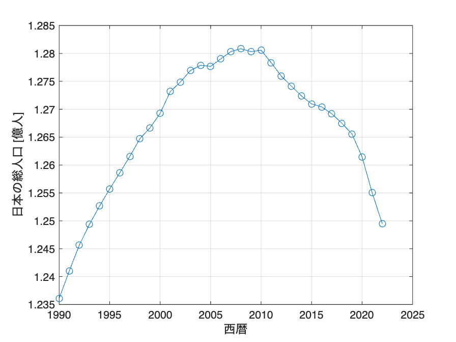
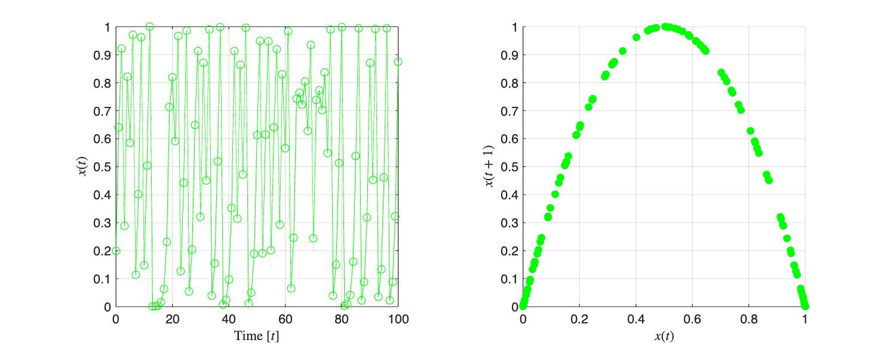
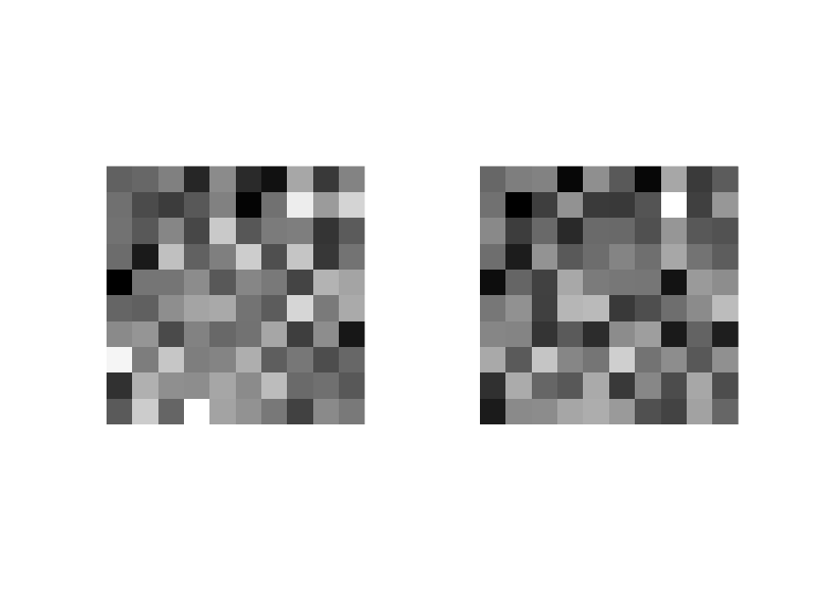
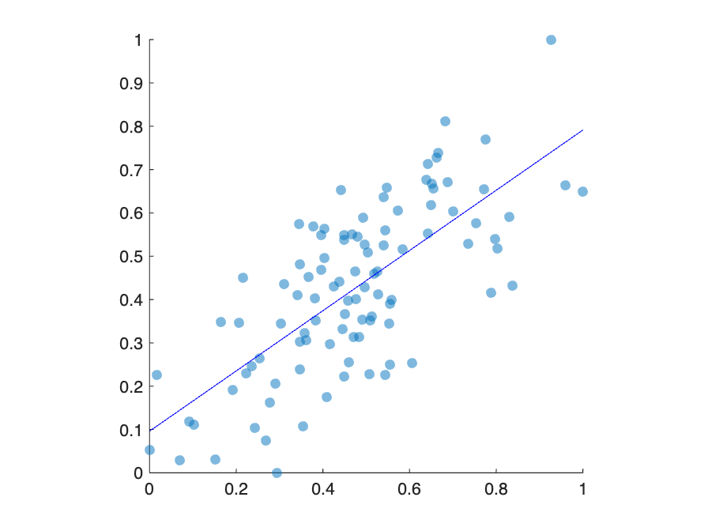
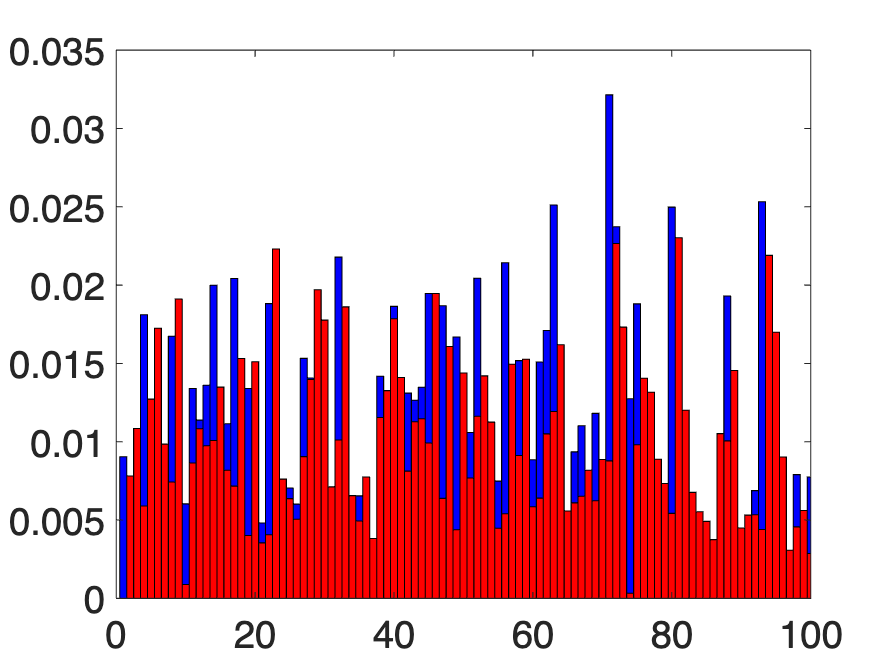
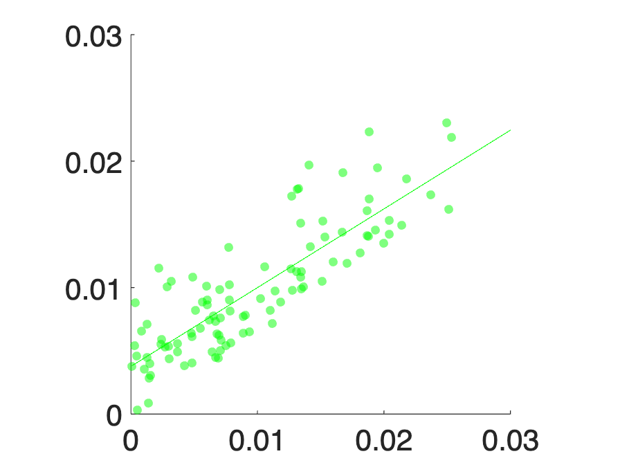
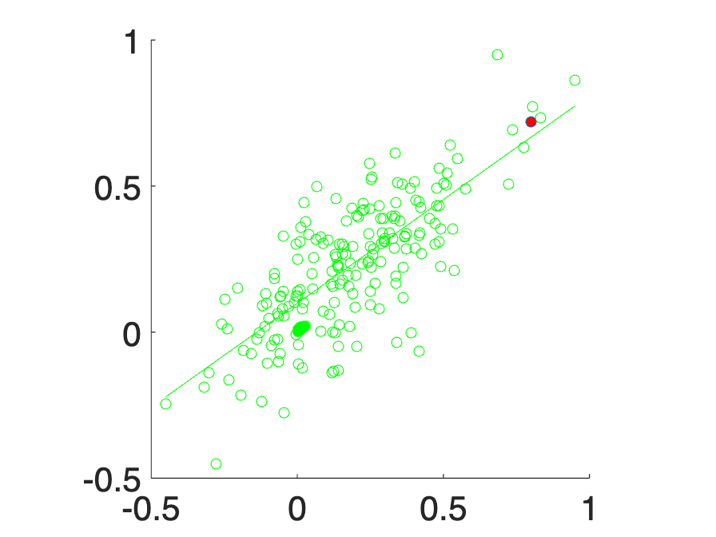

# 1.1 データを可視化するということ
## 図1.1.3 日本の総人口の推移
```matlab
% データを配列で提供
years = 1990:2022; % 年（1990年から2022年まで）
population = [1.23611, 1.24101, 1.24567, 1.24938, 1.25265, 1.2557, 1.25859, 1.26157, 1.26472, 1.26667, ...
1.26926, 1.27316, 1.27486, 1.27694, 1.27787, 1.27768, 1.27901, 1.28033, 1.28084, 1.28032, ...
2. 28057, 1.27834, 1.27593, 1.27414, 1.27237, 1.27095, 1.27042, 1.26919, 1.26749, 1.26555, ...
3. 26146, 1.25502, 1.24947]; % 人口（億人単位）

% グラフの描画
figure('Units', 'inches', 'Position', [0 0 5 3]); % グラフのサイズ指定
plot(years, population, '-o'); % 折れ線グラフの描画

% 軸ラベルの設定
xlabel('西暦'); % x軸のラベル
ylabel('日本の総人口 [億人]'); % y軸のラベル

% その他のグラフ設定
grid on; % グリッドを表示

% グラフをファイルに保存
print('../figures/1_1_3_population_line_plot','-dpng','-r300'); % dpiを指定して保存
```


## 図1.1.4 散布図でみる総人口
```matlab
% データを配列で提供
years = 1990:2022; % 年（1990年から2022年まで）
population = [1.23611, 1.24101, 1.24567, 1.24938, 1.25265, 1.2557, 1.25859, 1.26157, 1.26472, 1.26667, ...
1.26926, 1.27316, 1.27486, 1.27694, 1.27787, 1.27768, 1.27901, 1.28033, 1.28084, 1.28032, ...
2. 28057, 1.27834, 1.27593, 1.27414, 1.27237, 1.27095, 1.27042, 1.26919, 1.26749, 1.26555, ...
3. 26146, 1.25502, 1.24947]; % 人口（億人単位）

% 散布図の作成
% 現在の年と次の年の人口を保持する新しい配列を作成
next_year_population = population(2:end); % 次の年の人口列を作成

% グラフの描画
figure('Units', 'inches', 'Position', [0 0 5 5]); % グラフのサイズを指定する場合
scatter(population(1:end-1), next_year_population,'filled'); % 散布図の描画

% 軸の範囲設定
xlim([1.23, 1.29]); % x軸の範囲設定
ylim([1.23, 1.29]); % y軸の範囲設定

% 軸ラベルの設定
xlabel('ある年の日本の総人口 [億人]'); % x軸のラベル
ylabel('次の年の日本の総人口 [億人]'); % y軸のラベル

% その他のグラフ設定
grid on; % グリッドを表示
% グラフをファイルに保存
print('../figures/1_1_4_population_scatter_plot','-dpng','-r300'); % dpiを指定して保存
```


## 図 1.1.5 折れ線グラフと散布図による可視化例その 2
```matlab
% データの定義
t = 0:1:100; % 時間軸（0から100まで）
x_t = [
    0.2, 0.64, 0.9216, 0.28901376, 0.821939226, 0.585420539, 0.970813326, 0.113339247, 0.401973849, 0.961563495, ...
    0.14783656, 0.503923646, 0.99993842, 0.000246305, 0.000984976, 0.003936025, 0.015682131, 0.061744808, 0.231729548, 0.712123859, ...
    0.820013873, 0.590364483, 0.967337041, 0.126384362, 0.441645421, 0.986378972, 0.053741981, 0.203415122, 0.648149641, 0.912206736, ...
    0.320342428, 0.870892628, 0.449754634, 0.989901613, 0.039985639, 0.153547151, 0.519881693, 0.998418873, 0.006314507, 0.025098538, ...
    0.097874404, 0.35318002, 0.913775574, 0.315159096, 0.863335361, 0.471949661, 0.996852714, 0.012549522, 0.049568127, 0.188444511, ...
    0.611732709, 0.950063207, 0.189772438, 0.61503544, 0.94706739, 0.200522995, 0.641254094, 0.920189124, 0.293764402, 0.829867512, ...
    0.564749697, 0.983229907, 0.065955428, 0.246421239, 0.742791249, 0.764209638, 0.720773069, 0.805037009, 0.627809693, 0.934658729, ...
    0.244287156, 0.738443765, 0.772578283, 0.702804318, 0.835481634, 0.549808293, 0.990076536, 0.039299956, 0.151021877, 0.512857079, ...
    0.999338782, 0.002643123, 0.010544547, 0.041733437, 0.15996703, 0.537510318, 0.994371904, 0.022385682, 0.087538253, 0.319501229, ...
    0.869680775, 0.4533445, 0.991293057, 0.034524528, 0.13333034, 0.462213442, 0.994288704, 0.022714708, 0.088795, 0.323641792, 0.87559113];

% サブプロットを含むグラフの作成
figure('Units', 'inches', 'Position', [0 0 10 4]); % レイアウト設定

% 時系列プロットの作成
tiledlayout(1,2) % 1x2 の tile 準備
nexttile
plot(t, x_t, 'o-', 'Color', 'green'); % 時系列グラフの描画
xlabel('Time [ $t$ ]', 'Interpreter', 'latex'); % x軸のラベル
ylabel(' $x(t)$ ', 'Interpreter', 'latex'); % y軸のラベル
grid on; % グリッドを表示

% ラグプロット（1ステップタイムラグの散布図）の作成
nexttile
scatter(x_t(1:end-1), x_t(2:end), 'filled', 'MarkerFaceColor', 'g'); % ラグプロットの描画
xlabel(' $x(t)$ ', 'Interpreter', 'latex'); % x軸のラベル
ylabel(' $x(t+1)$ ', 'Interpreter', 'latex'); % y軸のラベル
grid on; % グリッドを表示
% グラフをファイルに保存
print('../figures/1_1_5_logistic_map','-dpng','-r300'); % dpiを指定して保存
```


## 図 1.1.6 2 個体間の類似度のスコア化の仮想的な例
```matlab
% ヒートマップを生成
% 平均と共分散行列の定義
mean = [0, 0];
cov = [1, 0.8; 0.8, 1];

% 2変量正規分布からデータ生成
x = mvnrnd(mean, cov, 100);
x = reshape(x,[10,10,2]);
heatmap1 = x(:, :, 1);
heatmap2 = x(:, :, 2);

% 正規化
heatmap1 = (heatmap1 - min(heatmap1(:))) / (max(heatmap1(:)) - min(heatmap1(:)));
heatmap2 = (heatmap2 - min(heatmap2(:))) / (max(heatmap2(:)) - min(heatmap2(:)));

% 1次元配列に変換
x = heatmap1(:);
y = heatmap2(:);

% 線形回帰分析
X = [ones(length(x), 1) x];
b = regress(y, X);
slope = b(2);
intercept = b(1);

% ヒートマップの描画
figure;
tiledlayout(1,2)
nexttile
imshow(heatmap1, 'Colormap', gray, 'InitialMagnification', 'fit');

nexttile
imshow(heatmap2, 'Colormap', gray, 'InitialMagnification', 'fit');
print('../figures/1_1_6_visual_data','-dpng');
```



```matlab

% 散布図と回帰直線の描画
figure;
scatter(x, y, 'filled', 'MarkerFaceAlpha', 0.5);
hold on;
plot(x, intercept + slope * x, 'b');
axis equal;
xlim([0, 1]);
ylim([0, 1]);
print('../figures/1_1_6_scatter','-dpng','-r300');
```



```matlab

% 相関係数とp値の出力
[r, p] = corrcoef(x, y);
fprintf('Correlation coefficient: %f, p-value: %f\n', r(1,2), p(1,2));
```

```TextOutput
Correlation coefficient: 0.853839, p-value: 0.000000
```

```matlab

% 個体の位置データ
% 個体のデータ生成と変換
individual1 = abs(normrnd(0, 1, [100, 1]));
individual2 = abs(normrnd(0, 1, [100, 1]));
individual2 = 0.6 * individual1 + 0.4 * individual2;

% 正規化
individual1 = individual1 / sum(individual1);
individual2 = individual2 / sum(individual2);

% 線形回帰分析
X = [ones(length(individual1), 1) individual1];
b = regress(individual2, X);
slope = b(2);
intercept = b(1);

% バーチャートの描画
figure;
barWidth = 1;
r1 = 1:length(individual1);
r2 = r1 + barWidth;
bar(r1, individual1, 'b', 'BarWidth', barWidth);
hold on;
bar(r2, individual2, 'r', 'BarWidth', barWidth);
xlim([0, 100]);
set(gca, 'FontSize', 18);
print('../figures/1_1_6_location_index','-dpng','-r300');
```



```matlab

% 散布図と回帰直線の描画
figure;
scatter(individual1, individual2, 'filled', 'MarkerFaceColor', 'g', 'MarkerFaceAlpha', 0.5);
hold on;
plot(individual1, intercept + slope * individual1, 'g');
axis equal;
xlim([0, 0.03]);
ylim([0, 0.03]);
set(gca, 'XTick', [0, 0.01, 0.02, 0.03], 'YTick', [0, 0.01, 0.02, 0.03], 'FontSize', 20);
print('../figures/1_1_6_location_index_scatter','-dpng','-r300');
```



```matlab

% 相関係数とp値の出力
[r, p] = corrcoef(individual1, individual2);
fprintf('Correlation coefficient: %f, p-value: %f\n', r(1,2), p(1,2));
```

```TextOutput
Correlation coefficient: 0.811441, p-value: 0.000000
```
## 図 1.1.7 二つの類似度スコアの関係
```matlab
n = 190; % データ点の数
low = -0.45; high = 0.95; % データの範囲
rho = 0.7; % 相関係数
mean = [0, 0]; % 平均（二変数）
cov = [1, rho; rho, 1]; % 共分散行列

rng('default'); rng(0); % 乱数生成器のシード設定（固定）
data = mvnrnd(mean, cov, n - 1); % 多変量正規分布からデータ生成
x = data(:, 1);
y = data(:, 2);
x = low + (high - low) * (x - min(x)) / (max(x) - min(x)); % xデータの正規化
y = low + (high - low) * (y - min(y)) / (max(y) - min(y)); % yデータの正規化
x = [x; 0.80]; % 特定の点を追加
y = [y; 0.72]; % 特定の点を追加

% 線形回帰分析
X = [ones(length(x), 1) x];
b = regress(y, X);
slope = b(2);
intercept = b(1);

% 散布図の描画
scatter(x, y, 'MarkerEdgeColor', 'green', 'MarkerFaceAlpha', 0.5);
hold on; % 図の保持
plot(x, intercept + slope * x, 'Color', 'green'); % 回帰直線の描画
scatter(0.80, 0.72, 'MarkerEdgeColor', 'r'); % 特定の点を赤色で描画

axis equal; % アスペクト比を等しく設定
xticks([-0.5, 0.0, 0.5, 1]); % X軸の目盛り
yticks([-0.5, 0.0, 0.5, 1]); % Y軸の目盛り
xlim([-0.5, 1.0]); % X軸の表示範囲
ylim([-0.5, 1.0]); % Y軸の表示範囲
% 画像として保存
print('../figures/1_1_7_similarity_scatter', '-dpng', '-r300');
```


